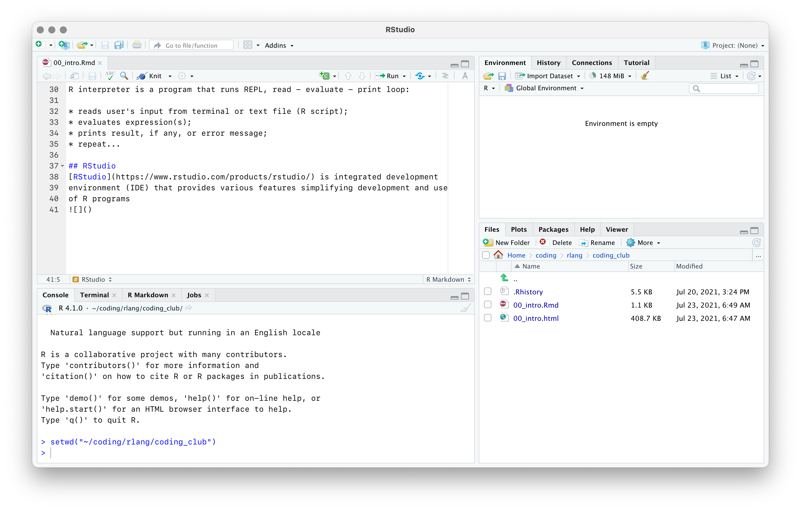

```{css, echo=FALSE}
pre {
  padding-top: 0;
  padding-bottom: 0;
  line-height: 1.5;
  font-size: 75%;
}
```

```{r setup, include=FALSE}
knitr::opts_chunk$set(echo = TRUE)
```

## {.smaller}

### **What is R?**

R is a programming language and its implementation providing environment
for data analyses

### **Installation**

Download and install R from CRAN: <https://cran.r-project.org>

Download and install RStudio: <https://www.rstudio.com/products/rstudio>

### **Resources for learning**

[An Introduction to R](https://cran.r-project.org/doc/manuals/r-release/R-intro.html) by R
Core Team

[R for Data Science](https://r4ds.had.co.nz) by Hadley Wickham and
Garrett Grolemund

[Advanced R](https://adv-r.hadley.nz) by Hadley Wickham

[These slides: github.com/nktvslv/intro_r_tidyverse](https://github.com/nktvslv/intro_r_tidyverse)

[Cheatsheets](https://github.com/nktvslv/intro_r_tidyverse/tree/main/cheatsheets)

## How R works

R is interpreted language

R interpreter is a program that runs REPL, read - evaluate - print loop:

-   reads user's input from terminal or text file (R script);
-   evaluates expression(s);
-   prints result, if any, or error message;
-   repeat...

## RStudio

[RStudio](https://www.rstudio.com/products/rstudio/) is integrated
development environment (IDE) providing various extras that simplify
development and use of R programs\

::: {.centered}
{width="80%"}
:::

## R data types

R has four basic data types:

-   integer numbers: `-1, 0, 1, 2, 3`
-   floating point numbers: `-14.5, 1.1, 2.5e8`
-   character strings: `"R is flexible", "A", "b", ""`
-   logical: `TRUE, FALSE`
-   each type has explicit missing value, `NA`

## R data structures. Vector

R stores values in **vector** data structure that may contain zero or
more values of only **one type** (e.g. integer vector, logical vector,
etc.)

```{r}
c(1, 2, 3) # use c() function to make vector
is.vector(c(1, 2, 3)) # check if data object is vector using is.vector()
is.vector(1) # singular values are stored in vectors, too
length(1) # use length() to see how many elements are in a vector
```

## R data structures. List

To combine values of different types in one object, R uses **list** data
structure

```{r}
list(1L, 2.5, c("ABC", "abc")) # use list() function to make list
is.list(list(1L, 2.5, c("ABC", "abc"))) # check if object is list with is.list()
length(list(1L, 2.5, c("ABC", "abc"))) # get number of elements in list using length()
```

## R data structures. Data frame

R **data frame** is to store and manipulate tabular data, think
spreadsheet

```{r}
data.frame(name = c("a","b","c"), value = c(1, 2, 3)) # create data frame object
is.data.frame(data.frame(name = c("a","b","c"), value = c(1, 2, 3)))
is.list(data.frame(name = c("a","b","c"), value = c(1, 2, 3))) # data frame is a list
```

## Variables

Variables are named objects, vectors, lists, data frames, etc

Use assignment operator `<-` to give name to an object:

```{r}
a <- data.frame(name = c("a","b","c"), value = c(1, 2, 3))
a
ncol(a); nrow(a)
```

## Variables

Variable names can have:

-   upper and lower case letters
-   period
-   numbers, but not start with number
-   underscore, but not start with underscore

Variable names should not have:

-   mathematical and logical operators: `+, -, /, *, ^, <, >, =, &, |`
-   special symbols: `?, !, @, #, $, %, (, )`
-   blank space

You can give any name to variable if surround it with quotes and call it
by surrounding with back quotes

## Subsetting

Use subsetting to get individual values or range of values from
collection objects

```{r}
my_vec <- c(one = 9, two = 8, three = 7, 6, "five-ish..." = 5)
my_vec[1]
my_vec["two"]
my_vec[c(4,5)]
```

## Subsetting {.smaller}

```{r}
my_df <- data.frame(color = c("red", "green", "blue"),
                    intensity = c(225L, 14L, 56L),
                    opacity = c(0.5, 0.25, 0.12))
my_df[1] # returns first column as data frame
my_df[[1]] # return first columns as vector
my_df[,1] # also unpacks fist columns
my_df[1,] # returns first row as data frame
my_df[1, 1] # return value from first row, first column
```

## Subsetting {.smaller}

```{r}
my_df["color"] # returns column color as data frame
my_df[["color"]] # returns column color as vector
my_df$color # as above
my_df[c("color","opacity")] # returns selected columns as data frame
my_df[c(1, 2), c("color","opacity")] # combine selections
```

## Functions {.smaller}

Function is an object that can perform operations on other objects,
given it is supplied with required arguments

Function definition determines what are the required arguments and what
operation function performs

```{r}
my_function <- function(first_arg = 1, second_arg = 2) {
  first_arg + second_arg
}
my_function() # call with default arguments
my_function(3, 4) # call with positional arguments
my_function(second_arg = 4, first_arg = 3) # call with named arguments
```

## Functions

Every action in R is a function call

Subsetting is a function call

```{r}
my_df["color"]
`[`(my_df, "color")
```

## Functions

Arithmetic and logical operations are function calls, too

```{r}
37 + 42 == `+`(37, 42)
(37 > 42) == `>`(37, 42)
```

## Functions

R let you re-define built-in functions

```{r}
1 + 2

### <b>
`+` <- function(e1, e2) {
  paste(e1, e2, sep = " + ")
}
### </b>

1 + 2
```

```{r,results='hide'}
rm(`+`) # remove re-defined plus function to restore default definition
```

## Packages

Functions and data structures serving particular purpose can be combined
in a **package**

Packages can be installed from centralized repositories:

-   [CRAN](https://cran.r-project.org), The Centralized R Archive Network
-   [Bioconductor](https://bioconductor.org), Collection of packages for
    biological data analysis
-   [GitHub](https://github.com)

## Packages

To install packages from CRAN use built-in function

```{r,eval=FALSE}
install.packages("tidyverse")
```

<br> To install from Bioconductor

```{r, eval=FALSE}
install.packages("BiocManager")
BiocManager::install("DESeq2")
```

<br> To install from GitHub

```{r, eval=FALSE}
install.packages("devtools")
devtools::install_github("r-lib/httr"")
```

# Tidyverse

## Tidyverse {.smaller}

### "R packages for data science

The tidyverse is an opinionated collection of R packages designed for
data science. All packages share an underlying design philosophy,
grammar, and data structures."\
[[tidyverse.org]{style="float:right;"}](https://www.tidyverse.org) <br>
Install `tidyverse`

```{r, eval=FALSE}
install.packages("tidyverse")
```

Load `tidyverse`

```{r}
library(tidyverse)
```

## Tidyverse packages

`tibble` re-implementation of data frame

`readr` reading data from files

`tidyr` reshaping, nesting and pivoting

`dplyr` data transformation

`purrr` functional programming

`stringr` working with character strings

`magrittr` connect operations with pipe

`ggplot2` data visualization

`...`

## Tidyverse for proteomics data analysis

Read list of proteins identified and quantitated by
[MaxQuant](https://maxquant.org)

```{r}
proteins <- read_tsv("proteinGroups.txt")
```

## Filter, select and mutate
```{r}
proteins0 <- proteins %>%
  filter(str_detect(`Protein IDs`, "CON|REV", negate = TRUE),
         str_detect(`Protein IDs`, "\\_ECOLI")) %>%
  mutate_at(grep("LFQ", names(.)), ~if_else(near(0, .), NA_real_, .)) %>%
  mutate_at(grep("LFQ", names(.)), ~log2(.)) %>%
  select(`Protein IDs`, grep("LFQ", names(.)))
```

## Impute missing values
```{r}
proteins1 <- bind_cols(
  proteins0[-grep("LFQ", names(proteins0))],
  as_tibble(impute::impute.knn(as.matrix(proteins0[grep("LFQ", names(proteins0))]))[["data"]])
)
```

## Pivot table
```{r}
proteins2 <- proteins1 %>%
  pivot_longer(cols = grep("LFQ", names(.)),
               names_to = "name",
               values_to = "value") %>%
  extract(name, c("spike","repl"), "([01]+)\\_([123])")
```

## Analysis of variance
```{r}
anova <- proteins2 %>%
  group_by(`Protein IDs`) %>%
  nest() %>%
  mutate(aov_model = map(.x = data,
                         .f = function(d){aov(value ~ spike, data = d)}),
         aov_sum = map(.x = aov_model,
                       .f = summary),
         pval = map_dbl(.x = aov_sum,
                        .f = function(s) {s[[1]]$`Pr(>F)`[1]})) %>%
  ungroup()
```

## Multiple test correction
```{r}
fdr <- anova %>%
  select(-data, -aov_model, -aov_sum) %>%
  mutate(fdr = p.adjust(pval, "fdr"),
         qval = qvalue::qvalue(pval)[["qvalues"]]) %>%
  arrange(fdr)

head(fdr, 5)
```

## Plotting
```{r, fig.align='center', fig.height=3, fig.width=6}
proteins2 %>%
  filter(str_detect(`Protein IDs`, "(MFD|UVRD|UVRA)\\_ECOLI")) %>%
  mutate(protein = str_match(`Protein IDs`, ".*\\|(.*?)\\_ECOLI")[,2]) %>%
  ggplot() +
  geom_boxplot(mapping = aes(x = spike, y = value)) +
  facet_wrap(~protein, scales = "free_y")
```
